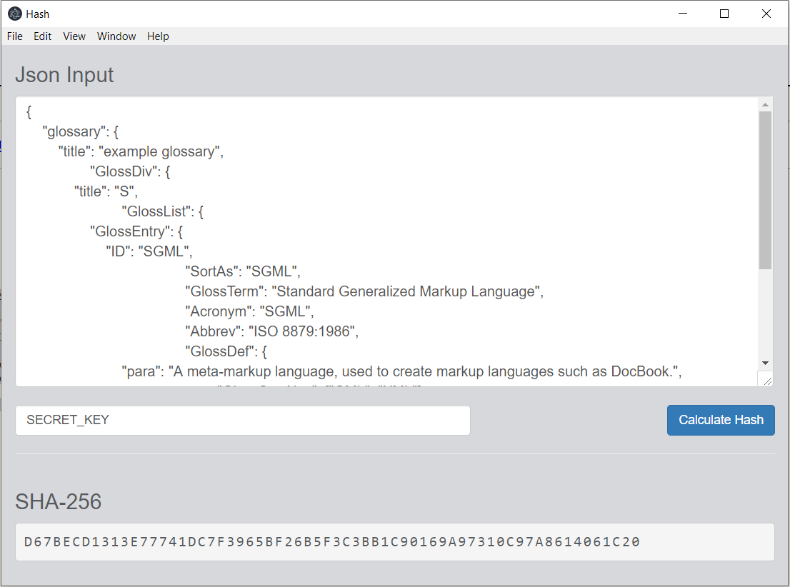

# JSON to HMAC SHA-256 Hash Calculator

Simple [Electron](http://electron.atom.io) application that converts json's HMAC SHA256 hash along with integrity salt.

## Getting started
- Install [Node LTS](https://nodejs.org)
- Clone this repository
- `cd HashCalculator`
- `npm install` to install the application's dependencies
- `npm start` to start the application